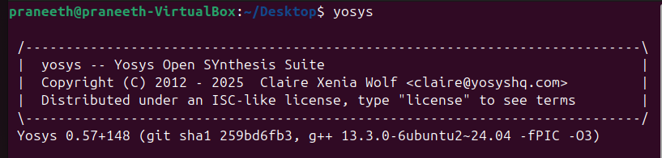
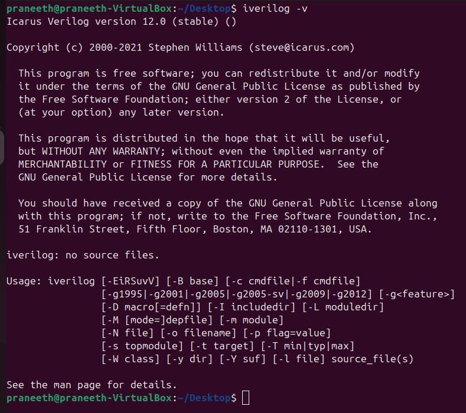

# Week 0 - Task 0  
**RISC-V Tapeout Preparation: Environment Setup**

---

## 🔧 System Configuration
- **RAM:** 6 GB  
- **Storage:** 50 GB HDD  
- **OS:** Ubuntu 20.04+  
- **CPU:** 4 vCPUs  

---

## 🛠 Tool Installation

### 1. Yosys (Logic Synthesis Tool)
Yosys is an open-source framework for RTL synthesis.  

**Installation Steps:**
```bash
sudo apt-get update
git clone https://github.com/YosysHQ/yosys.git
cd yosys
sudo apt install make
sudo apt-get install build-essential clang bison flex \
 libreadline-dev gawk tcl-dev libffi-dev git \
 graphviz xdot pkg-config python3 libboost-system-dev \
 libboost-python-dev libboost-filesystem-dev zlib1g-dev
make config-gcc
make
sudo make install
```


---

### 2. Icarus Verilog (Iverilog)
Icarus Verilog is used for Verilog simulation.

**Installation Steps:**
```bash
sudo apt-get update
sudo apt-get install iverilog
```


---

### 3. GTKWave (Waveform Viewer)
GTKWave is used to visualize simulation results.

**Installation Steps:**
```bash
sudo apt-get install gtkwave
```


---

## 📌 Summary
- System check completed ✅  
- Yosys installed for RTL synthesis ✅  
- Icarus Verilog installed for simulation ✅  
- GTKWave installed for waveform visualization ✅  
